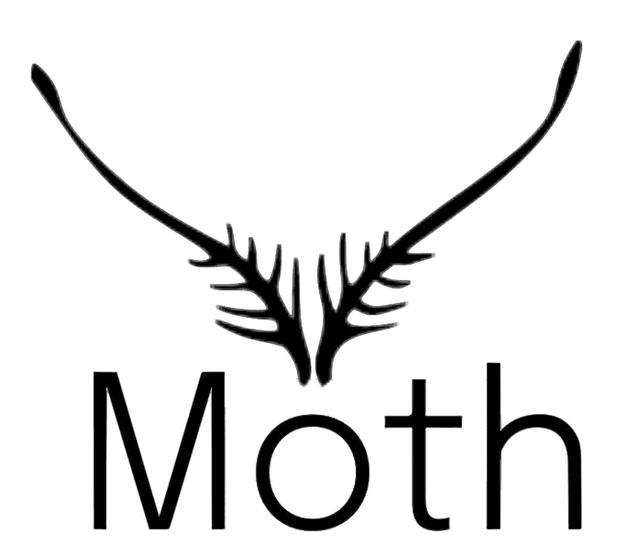

+++
title = "Testing my presentation"
outputs = ["Reveal"]
[reveal_hugo]
theme = "white"
+++
<!-- [logo]
src = "logo.png"
width = "12%" 
diag = "1%"  -->

<!-- # Moth -->

## Mid-year Report
Kate M. & Alex. B

---
## Problem Space
<!-- TODO: add real images -->

 Interactive art is an emerging domain of media that currently lacks tools that are approachable for entry level users and established artists.

 
<!-- {}The former is typically barred by financial cost{}
{}The latter by opportunity cost{} -->
<ul>
{}<li>The latter by opportunity cost</li>{}
{}<li>The former is typically barred by financial cost</li>{}
</ul>

---
{}
# Customer Description

---
## Established Artist

Looking for a <a>path</a> into the <a>interactive AR space</a>

---
## Early in Career (EIC) Artist

 Trying to start out, doesn’t have experience with many industry tools 

---
## Hobbyist

 Primary goal is learning and scraping together projects 

{} 

---
{}

# Proposed Solution 
---
**Smaller feature set than many industry standards**
<!-- 

 -->

More affordable and easier to learn
 

Focused in on interactivity

---
Integrating physical world & digital creations to make projected art

---

Simulations and <a>Live View</a> of end result enables easier workflow
{}

--- 
# Workflow Prototype

<!-- 
Key goal is to allow for interactivity
Integrating physical world, digital creations to make projected art
Simulations and “Live View” of end result enables easier workflow -->

---

---